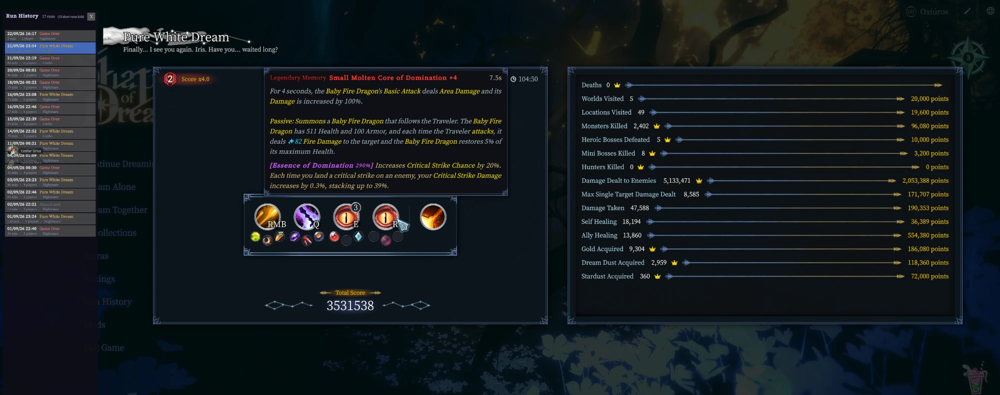

# Run History

A mod for [Shape of Dreams](https://store.steampowered.com/app/2444750/) that lets you
browse your past runs on the game's own end-of-run result screen, from the title menu.



## Why

The game keeps the last 20 results and overwrites older ones, and there's no way to look at
any of them once you've left the screen. So people screenshot their builds. This archives
every run to disk as it finishes and reuses the real result screen to show them back, with
the same layout, the same stat bars and the same tooltips on skills, memories and gems.

## What it does

- adds a **Run History** entry to the title menu
- scrollable list of every archived run: date, result, length, player count, difficulty
- click a run to open it, arrows switch between players in that run
- hover anything for the tooltip you'd get at the end of a match
- filters out very short runs and quick abandons, and says how many it hid

Gameplay is untouched. Nothing is sent over the network, and the window can only open
outside a match, since during a run the game already shows you everything.

Runs land in:

```
%USERPROFILE%\AppData\LocalLow\Lizard Smoothie\Shape of Dreams\RunHistory\
```

One per run, plain JSON, named `{startTimestamp}_{runId}.json`. Serialized with the game's
own serializer, so it round-trips exactly.

**Caveat:** archiving starts when you install the mod. Older runs are imported from the
game's last-20 list, so you keep whatever the game still remembers. Anything already
overwritten is gone.

## How it works

The result screen isn't a prefab. It's created inside `GameLogicPackage` in the `PlayGame`
scene, and destroyed on return to title. So the mod clones it the first time it sees one,
keeps the clone under a canvas of its own, and paints archived results into it.

A few things that were not obvious and are worth knowing if you're poking at this game:

- **Every `View` in the clone has to die.** `View.Awake` registers into a static
  `View.instances`, and `InGameUIManager.UpdateDisablePlayingInputByView()` walks that list.
  Leave one alive and the game decides a modal is open and kills gameplay input mid-match.
  Destroy them while the clone is still inactive, before any `Awake` runs.
- **Hidden views hide in three independent ways**: `GameObject.activeSelf`,
  `CanvasGroup.alpha`, and `Canvas.enabled` (set by `View.UpdateComponentStatus` from the
  alpha). Undo only two of them and you get a perfectly correct, invisible window.
- **`ScreenSpaceOverlay` always draws over `ScreenSpaceCamera`**, at any `sortingOrder`. The
  game's tooltip lives on `Global Canvas`, which is camera-space, so no sorting value will
  ever put it in front of an overlay canvas. This mod borrows the tooltip box into its own
  canvas while the window is open and gives it back on close.
- **Esc belongs to `GlobalUIManager.AddBackHandler(owner, priority, callback)`.** `GoBack()`
  walks handlers from highest priority down and stops at the first one returning `true`.
  Title registers at `-1`, lobby at `1`, the game's own modal windows at `100`. Reading the
  Esc key yourself means the window closes *and* the title opens its quit dialog.

## Building

Needs .NET Framework 4.8.1 targeting pack and the game installed.

```bash
export ShapeOfDreamsHome="/c/Program Files (x86)/Steam/steamapps/common/Shape of Dreams"
dotnet msbuild DewRunHistory.csproj /p:Configuration=Release
```

Then copy `about/`, `bin/Release/DewRunHistory.dll` into
`<game>/Mods/DewRunHistory/`, keeping the paths, and enable it in the in-game mod manager.

## License

MIT, see [LICENSE](LICENSE).
